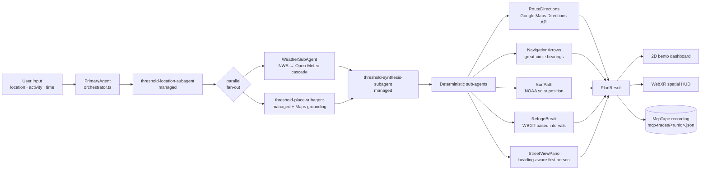

# Heat Threshold

**Built for Google I/O Hackathon · May 23, 2026 · 100% new work.**

Heat Threshold is an environmental scheduling tool. You tell it *where*, *what activity*, and *what time* — a primary Gemini 3.5 Flash agent dispatches three managed sub-agents (Location, Place, Synthesis) plus a Weather sub-agent and returns a scheduling verdict (`go` / `delay` / `alternate`) grounded in NWS weather, USMC 6200.1E flag thresholds, and live Google Maps refuges. The same plan renders as a 2D bento dashboard and as an interactive WebXR spatial HUD.

> **Threshold is an environmental scheduling tool, not medical advice. Consult a healthcare professional for health concerns.**

---

## Gemini 3.5 Flash across every surface

The same model powers every step of how this product was built and how it runs.

### 1. AI Studio (prompt iteration)
The `SynthesisSubAgent` system prompt — the one that owns the medical-advice firewall, the Stull (2011) wet-bulb citation, the USMC 6200.1E flag mapping, and the strict structured-output schema — was iterated against three real input cases (SF Ferry Building, Zilker Park Austin, Hyde Park London) inside [AI Studio](https://aistudio.google.com) before being committed to code as `SUBAGENT_SPECS.synthesis.systemInstruction` in [src/lib/agents/managedAgents.ts](src/lib/agents/managedAgents.ts). The three tuned cases are the [demoFixtures](src/lib/demoFixtures.ts) presets you can click on the dashboard.

### 2. Managed Agents (production runtime)
The product runs on the brand-new Gemini **Managed Agents API**. Three of the four LLM-bearing sub-agents are uploaded once as long-lived `Agent` definitions and invoked thereafter via `ai.interactions.create({ agent: <id>, ... })`. The whole surface is in [src/lib/agents/managedAgents.ts](src/lib/agents/managedAgents.ts); the orchestrator graph is in [src/lib/agents/orchestrator.ts](src/lib/agents/orchestrator.ts).

| Managed Agent ID | Role | Tools |
|---|---|---|
| `threshold-location-subagent` | Free-form location → coordinates + waypoints | (none) |
| `threshold-place-subagent` | Real Google Maps refuges near a coord | `googleMaps` grounding (per-interaction) + **Maps Imagery Grounding** widget token ([docs](https://mapsplatform.google.com/maps-products/grounding/#maps-imagery-grounding)) |
| `threshold-synthesis-subagent` | Composes the final go/delay/alternate verdict | (none) |

Reference: [ai.google.dev/gemini-api/docs/agents](https://ai.google.dev/gemini-api/docs/agents).

### 3. Antigravity CLI / IDE *(best-effort)*
A `/threshold-plan` skill that POSTs to `/api/plan` from inside the Antigravity CLI and IDE. Ship status is recorded in the [docs/](docs/) folder — if the skill landed, screencaps live there; if it was cut for time, the section is marked accordingly.

### Why "every surface" matters
Gemini 3.5 Flash isn't just the model we called. It's the model we authored the prompts in (AI Studio), the model we drove from our dev environment (Antigravity), and the model running every sub-agent in production (Managed Agents). Same model, multiple surfaces, one workflow.

---

## Managed Agents architecture



The PrimaryAgent dispatches **WeatherSubAgent + PlaceSubAgent in parallel** via `Promise.all` — the canonical Managed Agents parallel-agent pattern. Both managed sub-agents are independent (they depend on the location resolution but not each other) and the synthesis serializes their results.

Nine sub-agents land in every `PlanResult.agentTrace[]`:

1. **LocationResolutionSubAgent** (managed) — geocoding + waypoint extraction
2. **WeatherSubAgent** — NWS api.weather.gov → Open-Meteo → simulated cascade ([src/lib/weatherService.ts](src/lib/weatherService.ts))
3. **PlaceSubAgent** (managed + Google Maps grounding) — real refuges
4. **SynthesisSubAgent** (managed, structured output) — final verdict
5. **RouteDirectionsSubAgent** — Google Maps Directions API (walking mode), polyline + structured turn-by-turn steps
6. **NavigationArrowsSubAgent** — great-circle bearings per step → ground-anchored arrows in XR
7. **SunPathSubAgent** — NOAA solar position math → shaded vs sun-exposed route segments
8. **RefugeBreakSubAgent** — USMC-flag-driven work/rest intervals along the polyline
9. **StreetViewPanoSubAgent** — heading-aware first-person Street View URIs on every node

---

## Observability + replay

The trace/record/replay stack is the demo safety net and the secondary technical pitch.

### PlatAtlas (span recording)
[src/lib/observability/platatlas.ts](src/lib/observability/platatlas.ts) — every LLM-bearing sub-agent runs inside `recorder.withSpan(name, attributes, work)`. Each span records start/end timestamps, status (running / success / failed), attributes (`managed_agent`, `tool`, `schema`), and an output summary string. Parallel sub-agents are safe — spans attach directly to the PrimaryAgent root.

### McpTape (recording)
[src/lib/observability/mcptape.ts](src/lib/observability/mcptape.ts) — every successful run is written to `mcp-traces/<runId>.json` containing the full `PlanResult` plus the PlatAtlas span tree. Fire-and-forget so recording errors never bubble to the user.

**Two storage backends, transparent to callers:**
- **Vercel Blob** (production, when `BLOB_READ_WRITE_TOKEN` is set) — runs survive cold starts and are replayable forever.
- **Filesystem** (local dev + production fallback for bundled fixtures) — `mcp-traces/<runId>.json` committed to the repo ships with the deploy.

McpReplay tries Blob first, then filesystem, so the two are interchangeable.

### McpReplay (playback)
[src/lib/observability/mcpreplay.ts](src/lib/observability/mcpreplay.ts) — `GET /api/replay/:runId` returns the cached PlanResult; `GET /api/trace/:runId` returns the span tree. The dashboard supports `?replay=<runId>` to hydrate from a recording instead of generating a new run. **This is the demo safety net** — if the live managed-agents call fails on stage, swapping to `?replay=<id>` produces an identical card from cached LLM responses.

### Trace viewer
[/trace/:runId](src/components/TraceViewer.tsx) renders the span tree with proportional duration bars, per-span attributes, and a "Replay this run on dashboard" link.

---

## Live demo

<!-- DEMO_URLS · update the four `TODO_` values below before submission. -->

| Resource | URL |
|---|---|
| **Production dashboard** | `TODO_PROD_URL` |
| **1-min demo video** | `TODO_VIDEO_URL` |
| Trace viewer | `TODO_PROD_URL/trace/TODO_RUNID` |
| Demo presets | `TODO_PROD_URL/?demo=sf-route` · `?demo=zilker-bike` · `?demo=hyde-park` |
| McpReplay safety net | `TODO_PROD_URL/?replay=TODO_RUNID` |

To replace all five at once:

```bash
sed -i.bak \
  -e 's|TODO_PROD_URL|https://heat-threshold.vercel.app|g' \
  -e 's|TODO_VIDEO_URL|https://youtu.be/XXXXXXXXXXX|g' \
  -e 's|TODO_RUNID|abc123de-...|g' \
  README.md && rm README.md.bak
```

Each preset generates a different verdict shape so the dashboard never looks empty.

---

## Live Watch mode

Click the **Live Watch** toggle in the dashboard header (`Radio` icon). The browser polls `POST /api/watch/tick` every 60 seconds with the current `PlanResult`, re-runs only the cheap parts of the graph (weather cascade + flag re-evaluation), and updates the dashboard *and* the WebXR HUD in real time via `postMessage`. No re-payment of the geocoding + grounding cost per tick.

---

## WebXR spatial HUD

[public/xr.html](public/xr.html) is a self-contained xrblocks scene that consumes the same `PlanResult` JSON via URL parameters. It renders:

- **Holographic route projection** — origin + waypoints + cooling stops as 3D nodes with connecting lines and a true-north reference rose.
- **Ground arrows** from `NavigationArrowsSubAgent` with a travelling opacity wave that pulses along the path.
- **Shade overlay** from `SunPathSubAgent` — route segments colored amber (sun-exposed) → teal (shaded) using NOAA-derived solar elevation.
- **Hydration / shade beacons** at every suggested rest break — pulsing vertical beams selectable to surface Street View previews.
- **Google Photorealistic 3D Tiles floor** when a `gmpKey` URL param is supplied — renders a coffee-table-sized chunk of the actual neighborhood under the route projection via [3d-tiles-renderer](https://github.com/NASA-AMMOS/3DTilesRendererJS) + [Google Map Tiles API](https://developers.google.com/maps/documentation/tile/3d-tiles).
- **Webcam passthrough background** — `navigator.mediaDevices.getUserMedia({ facingMode: 'environment' })` paints the real environment on a far-back plane so the HUD floats over reality on desktop. AR headsets handle passthrough natively.
- **Live Watch panel** that hot-updates the wet-bulb readout via `postMessage` ticks from the dashboard.
- **Transient-failure shield** — a narrow `window.error` allowlist suppresses the cosmetic xrblocks simulator crash that fires after CDN drop-outs (see [src/lib/observability/](src/lib/observability/) for the live monitoring story; the shield is in xr.html itself).

URL params: `verdict`, `headline`, `reasoning`, `wetBulb`, `flag`, `spatial` (JSON), `stops` (JSON), `breaks` (JSON), `watch` (`0`/`1`), `gmpKey` (optional, enables 3D Tiles). The dashboard's `Launch spatial xr 3D` button builds this URL from the current `PlanResult`.

---

## Local dev setup

Prereqs: Node 20+ and a `GEMINI_API_KEY`.

```bash
git clone https://github.com/HeatThreshold/HeatThreshold.git
cd HeatThreshold
npm install
cp .env.example .env   # fill in GEMINI_API_KEY (required) + GOOGLE_MAPS_PLATFORM_KEY (optional)
npm run dev            # http://localhost:3000
```

Optional env:
- `GOOGLE_MAPS_PLATFORM_KEY` — unlocks **three** Maps features at once: the live Google Maps embed on the dashboard (falls back to Leaflet/OSM), the live Directions API polyline in `RouteDirectionsSubAgent` (falls back to straight-line interpolation), and the Google Photorealistic 3D Tiles floor in the WebXR scene (falls back to a flat satellite plane). The dashboard forwards this key to `xr.html` via the `gmpKey` URL param.

API surface:
- `POST /api/plan { location, activity, time }` → live managed-agents run
- `GET /api/plan?demo=sf-route|zilker-bike|hyde-park` → instant preset
- `POST /api/watch/tick { plan }` → one Live Watch tick
- `GET /api/replay/:runId` → cached McpTape PlanResult
- `GET /api/trace/:runId` → PlatAtlas span tree
- `GET /api/runs` → list of recorded runs
- `GET /api/weather?lat=&lng=` → raw NWS → Open-Meteo cascade output (debugging)

---

## Production deploy

Deployed on Vercel as a serverless function. The architecture matches local dev but with one extra layer of indirection so the Express app can serve both:

- [src/server/createApp.ts](src/server/createApp.ts) — pure Express factory. Registers every `/api/*` route. No `app.listen`, no Vite middleware.
- [server.ts](server.ts) — dev wrapper. Wraps `createApp()` in Vite middleware and `listen(:3000)`. Used by `npm run dev` only.
- [api/index.ts](api/index.ts) — Vercel function entry. Five lines: `createApp()` → default export.
- [vercel.json](vercel.json) — rewrites `/api/(.*)` → `/api/index` so every endpoint funnels through one cold-start, sharing the Gemini client + McpTape cache. `includeFiles: mcp-traces/**` ships baked-in recordings with the deploy so McpReplay still works without a live API call.
- [.github/workflows/deploy.yml](.github/workflows/deploy.yml) — runs `vercel pull → build → deploy` on every push to main (production) and every PR (preview). Requires repo secrets `VERCEL_TOKEN`, `VERCEL_ORG_ID`, `VERCEL_PROJECT_ID`.

See [docs/OPERATIONS.md](docs/OPERATIONS.md) for the full deploy + secrets + safety-net runbook.

---

## Verification

```bash
npm run lint                  # tsc --noEmit, clean
git log --since="2026-05-23"  # ≥15 commits, all today
grep -RIn "medical\|diagnosis\|symptoms\|treatment\|illness" src/ \
  | grep -v "Speak only about\|Hard rules:\|FIREWALL\|never use:\|not medical advice"
                              # zero hits outside the medical-firewall instructions
```

---

## Roadmap (not built during hackathon)

- **Watch mode** as a long-horizon managed agent. A `MonitorSubAgent` would persist a PlanResult, re-tick on a 15-minute cron, and push PWA notifications when the verdict changes — extending Managed Agents from a one-shot request into a persistent loop. The Live Watch tick endpoint is the foundation.
- **Multi-modal shade assessment**: a `assessShadeCoverage` per-interaction tool on `threshold-place-subagent` that runs Gemini 3.5 Flash Vision on a user-uploaded photo of the route to confirm or refute the `SunPathSubAgent` heuristic.
- **Historical comparison** via Open-Meteo's climate archive: *"Today's wet-bulb is 7°F above the 10-year mean for this date in this city."*
- **Calendar ICS export**: "Add this delay window to your calendar."
- **Migrate `DirectionsService` → `google.maps.routes.Route.computeRoutes`** (deprecated Feb 25, 2026 with a 12+ month sunset window). The new Routes API also exposes per-segment toll/traffic data we don't surface today. See [migration guide](https://developers.google.com/maps/documentation/javascript/routes/routes-js-migration).

---

## Author background

The author previously built **HeatSentry**, a private Flutter heat-monitoring app. **No HeatSentry code, assets, copy, or services are used in Heat Threshold.** This repository was created on May 23, 2026 and every line was written during the hackathon window (10:30 AM – 5:00 PM PT, with the WebXR + observability + Managed Agents migration landing during the build).

---

## License

MIT. See [LICENSE](LICENSE).

> **Threshold is an environmental scheduling tool, not medical advice. Consult a healthcare professional for health concerns.**
